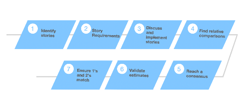

# Handbook of Best Practices

This handbook contains a set of best practices that are proven approaches to software development.
When used in combination, they focus on the main causes of software development problems. They are
called "best practices" not because we can specifically measure their value but rather they are
viewed to frequently be used in industry by successful organizations. Each of the best practices
emphasize and empower each other in order to accomplish the best results.

&nbsp;

## Table of Contents


**[Task Estimation in Scrum](#task-estimation)**<br>
&nbsp;&nbsp;&nbsp;&nbsp;&nbsp;&nbsp; [Building a successful story point estimation](#1-building-a-successful-story-point-estimation)<br>
&nbsp;&nbsp;&nbsp;&nbsp;&nbsp;&nbsp; [The importance of story point estimation](#2-the-importance-of-story-point-estimation)<br>
&nbsp;&nbsp;&nbsp;&nbsp;&nbsp;&nbsp; [Challenges](#3-challenges)<br>
&nbsp;&nbsp;&nbsp;&nbsp;&nbsp;&nbsp; [Overcoming estimation challenges](#4-overcoming-estimation-challenges)<br>
&nbsp;&nbsp;&nbsp;&nbsp;&nbsp;&nbsp; [Bad practices of task estimation](#5-bad-practices-of-task-estimation)<br>
&nbsp;&nbsp;&nbsp;&nbsp;&nbsp;&nbsp; [Advantages and disadvantages of twice estimation](#6-advantages-and-disadvantages-of-twice-estimation)<br>

**[Coding Standards](#coding-standards)**<br>
&nbsp;&nbsp;&nbsp;&nbsp;&nbsp;&nbsp; [Purpose of Having Coding Standards](#purpose-of-having-coding-standards)<br>
&nbsp;&nbsp;&nbsp;&nbsp;&nbsp;&nbsp; [Indentation](#1-indentation)<br>
&nbsp;&nbsp;&nbsp;&nbsp;&nbsp;&nbsp; [Principle of DRY](#2-principle-of-dry)<br>
&nbsp;&nbsp;&nbsp;&nbsp;&nbsp;&nbsp; [Avoid Commenting on Obvious Things](#3-avoid-commenting-on-obvious-things)<br>
&nbsp;&nbsp;&nbsp;&nbsp;&nbsp;&nbsp; [Limited use of globals](#4-limited-use-of-globals)<br>
&nbsp;&nbsp;&nbsp;&nbsp;&nbsp;&nbsp; [Code Comments and Proper Documentation](#5-code-comments-and-proper-documentation)<br>
&nbsp;&nbsp;&nbsp;&nbsp;&nbsp;&nbsp; [Proper and Consistent Scheme for Naming](#6-proper-and-consistent-scheme-for-naming)<br>
&nbsp;&nbsp;&nbsp;&nbsp;&nbsp;&nbsp; [Refactoring of code](#7-refactoring-of-code)<br>
&nbsp;&nbsp;&nbsp;&nbsp;&nbsp;&nbsp; [Write test cases](#8-write-test-cases)<br>
&nbsp;&nbsp;&nbsp;&nbsp;&nbsp;&nbsp; [Length of functions should not be very large](#9-length-of-functions-should-not-be-very-large)<br>

**[Code Reviews](#code-reviews)**<br>
&nbsp;&nbsp;&nbsp;&nbsp;&nbsp;&nbsp; [How to perform a Tool-Assisted code review](#1-how-to-perform-a-tool-assisted-code-review)<br>
&nbsp;&nbsp;&nbsp;&nbsp;&nbsp;&nbsp; [How to Make Code Reviews Better](#2-how-to-make-code-reviews-better)<br>
&nbsp;&nbsp;&nbsp;&nbsp;&nbsp;&nbsp; [Code Review Checklist](#3-code-review-checklist)<br>
&nbsp;&nbsp;&nbsp;&nbsp;&nbsp;&nbsp; [Reviewers guidelines on code reviews](#4reviewersguidelinesoncodereviews)<br>
&nbsp;&nbsp;&nbsp;&nbsp;&nbsp;&nbsp; [Examples of code reviews](#5examplesofcodereviews)<br>

&nbsp;

## Task Estimation in Scrum


The Sprint Planning meeting is the Scrum ceremony where the team estimates all tasks associated with each user story in the Sprint backlog. 
The estimation effort focuses on all resources required to complete the tasks for each Sprint. 

A shared task list is used to estimate the 
duration and effort for each user story in the backlog. Such practice results in a shared team perspective, resulting in a task estimation
process that is consistent and reliable throughout all Sprints. 

&nbsp;

#### Efficient and successful task estimation can be achieved by applying the following points:

### 1. Building a successful story point estimation

---
In Task Estimation, team does a comparative analysis between all of the stories for the project. For each story to be sized, 
 the following as a team(Product Owner, Core Scrum team including developers, testers & scrum master):




&nbsp;

### 2. The importance of story point estimation

---
Often happens that one person estimates a project, but other people complete the tasks. In this case, Story Points are indispensable. An example of why story points better than hours is illustrated in the example below:

> A company has a project at 200 story points(SP). One engineer starts working on it. His velocity is 1 SP per 3 hours. The start date is May 30th. Based on this information.

it’s easy to calculate the project release date as follows:

1. The time needed to finish all the work :


    **T=Qsp*t**
       
    200x3 = 600 (hours).

2. The number of workdays:

    **Nw=T/Prt**
       
    600 / 6 = 100 (workdays).

**Solution:** Having a calendar at hand, we can then calculate a release date — October 14th.    

&nbsp;    

| Formula keywords |  |
| ------ | ----------- |
| Qsp   | general quantity of SP |
| T | Time |
| Nw    | Number of days |
| Prt    | quantity of productive hours (usually 6 hours) |


&nbsp;


&nbsp;

### 3. Challenges

---

Even-though task estimation provides usefulness in project planning as mentioned in the above points. There are a few challenges facing individuals who are assigned with task estimation would be :

* Distinction between estimates and commitments.
* Features are not prioritised and are just developed in a random order.
* Uncertainty in those estimates is often ignored.
* Planning is often based on completing activities rather than features.

&nbsp;

### 4. Overcoming estimation challenges

---

It is worth highlighting the challenges behind creating good estimates. The key motivation behind good estimation is to be useful for project planning. The following points would guide any engineer to overcome challenges facing the task estimation process in scrum:


1. Get Two Perspectives On The Project
2. Use Past Knowledge
3. Involve The People Who Will Actually Do The Work
4. Factor In The Partnerships
5. Identify and Investigate High-Risk Items

&nbsp;

### 5. Bad practices of task estimation

---

Teams can get better at estimating tasks to provide accurate forecasts. Common biggest pain point for the teams is predictability. The following scenarios are examples where the team may fail to conduct good task estimation practices :


1. Teams are interrupted with production issues or other
   responsibilities.

2. Teams give estimates to engineers as if they were full-time dedicated, but they have many initiatives in progress.

3. Teams aren't stable; people come and go regularly to help on other things or contractors leave the program entirely.

4. Team is working on a brand new initiative and has never done this kind of work before.

&nbsp;

### 6. Advantages and disadvantages of twice estimation

---

Twice estimation in sprint planning allows the team to break down into small tasks team members can pick-up. The team estimates these tasks in hours. The total work is the sum of all tasks in hours. This can then be compared to he actual capacity of the team to deliver work. The following table showcases the advantages and disadvantages of twice estimation:

| Advantages| Disadvantages |
| --------------- | --------------- |
| More Control Over Your Sprint | 	Overhead Which Does Not Necessarily Improve Accuracy Of Estimates |
| 	More Accurate Estimates | Working In Hours In Combination With Logging Hours |
| 	Preventing Over- And Under Committing | Working In Hours May Lead To Micro-Managing Or Punishing Team Members |
| 		Clear How Much Work Is Left For Unfinished Issues |  |
| 	Valuable Input For Retrospective |  |


&nbsp;

|References |
|---|
|[Challenges of task estimation and overcoming them](https://www.aversan.com/coding-standards-and-best-practices-2/)|
|[Bad practices of task estimation](https://www.linkedin.com/pulse/why-your-agile-teams-bad-estimation-heidi-araya)|
|[Advantages and disadvantages of twice estimation](https://maartendalmijn.com/why-estimate-twice-in-scrum-fd0d68744501)|
|[Building a successful story point estimation](http://www.agilebuddha.com/agile/agile-estimation-8-steps-to-successful-story-point-estimation/)|
|[The importance of story point estimation](https://rubygarage.org/blog/3-reasons-to-estimate-with-story-points)|

&nbsp;

## Coding Standards

In the Software Development Industry, standardization has a positive impact in every business therefore certain coding
standards are essential for successful software development. They are an array of actions that can be defined for a
particular programming language specifying a programming style, the methods and different procedures that need to be
followed.

A coding standard makes sure that all developers working on a project follow certain guidelines. It is very important
for the programmers to maintain the coding standard, so it can be easily understood and maintained with proper
consistency.

&nbsp;

#### Purpose of Having Coding Standards:

* A coding standard gives a uniform appearance to the code written by various developers.
* It increases the efficiency of developers and promotes robust programming.
* It improves reliability, helps maintain the code and reduce its complexity.
* It reduces code duplication and helps code reuse making it easier to detect errors.

&nbsp;

##### Some of the coding standards are given below:

### 1. Indentation

---
Proper and consistent indentation should be followed throughout the code to increase the readability of the code. For
this, developers should make proper use of whitespaces:

* Between two function arguments there must be a space after a comma.
* Appropriate indentation should be there at the start and the end of each block in the program.
* Nested blocks of code should be properly spaced and indented.
* All braces should start from a new line, and the code that follows the braces should also start on a new line.

```html

<div style=”background-color: blue”> <! –div start–>

    <h2> A heading</h2>

    <p> A paragraph.</p>

</div> <! — div end –>

```

&nbsp;

### 2. Principle of DRY

---

When coding, developers should remember the principle of DRY, which means
**"Don't Repeat Yourself"**. It is a good practice to avoid duplication of code as it can eventually lead to
unmaintainable and buggy systems. Therefore, the code in the application should be such that the same code is not
repeated over and over.

```python
def my_function():
    print("I will not repeat my code!")
    print("I will not repeat my code!")
    print("I will not repeat my code!")
    print("I will not repeat my code!")
    print("I will not repeat my code!")
```

&nbsp;

### 3. Avoid Commenting on Obvious Things

---

While following the standards, make sure that you do not comment unnecessarily. Too much explanation will make your code
look clumsy. For example:

```java
for(int i=0;i<10;i++) //for loop starts here
        { //starting brace

        // logic starts here

        } //ending brace
```

&nbsp;

### 4. Limited use of globals

---

Code is generally clearer and easier to maintain when it does not use globals. Global variables can be read or modified by any part of the program, making it difficult to identify the reason for every time it is used. Because global variables can be get or set by any part of the program, any rules regarding its use can be easily broken. Also, because globals are available everywhere, you might unknowingly end up using it when you think you are using a local variable (or vice versa).

&nbsp;

### 5. Code Comments and Proper Documentation

---

It is good to comment while writing code as it helps other developers to understand your code. It is good practice to start every method or function with a comment specifying what the method or function does, about its parameters and return values. Also the role of each class and file, their contents and any steps of complex code should be commented. For example, 

```java
/* this function will used to divide two variables */

int Divide()
{

//logic of the function

}
```

&nbsp;

### 6. Proper and Consistent Scheme for Naming

---

The main naming conventions are:

* camelCase: This is where the first letter of each word is capatalised, except for the first word.

* under_score: This is naming by using an underscore between the words.

It is the choice of the developer as to which naming scheme is used in the program, but is very important to maintain the consistency of the naming scheme throughout the code. Conventionally camelCase is used in Java while under_score is used in PHP.

&nbsp;

### 7. Refactoring of code

---

Refactoring means to restructure your existing code to improve its internal structure while maintaining its external behavior. This is done to modernise software, increasing a system's maintainability, enhancing performance and security as well as improving the readability of the code. It is extremely important when performing this procedure to avoid modifying the basic functionality of the code.

&nbsp;

### 8. Write test cases

---

Test cases can be vital to verify the functionality of your code, what it takes in and what it should return. By creating test case you will get an understanding for when a piece of your code should work and when it should fail. A test case includes specific variables or conditions to compare the expected and the actual results of your code. You should implement test cases to cover different levels of complexity for your code, and no two test cases should test the same concept.

&nbsp;

### 9. Length of functions should not be very large

---

Functions should be small enough as to carry out a small amount of work and lengthy functions should be broken down in small ones which complete small tasks. Lengthy functions can be very hard to read and understand. You can measure your functions by counting the number of things it achieves and to keep your functions as small as possible the function should do only one thing. This is important to help keep your functions from becoming overly complex as well as improving the readability of your code. Keep your functions focused on doing one thing and doing it well.

&nbsp;

|References |
|---|
|[Coding Standards and Guidelines](https://www.geeksforgeeks.org/coding-standards-and-guidelines/)|
[Importance of Code Quality and Coding Standard](https://www.multidots.com/importance-of-code-quality-and-coding-standard-in-software-development/)|
|[Coding Standards and Best Practices](https://www.aversan.com/coding-standards-and-best-practices-2/)|
|[Write Better Code with Coding Standards](https://levelup.gitconnected.com/write-better-code-with-coding-standards-546faf3fd4d1)|