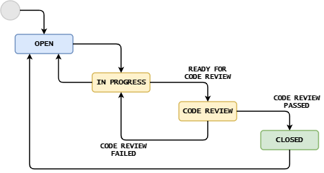

## Code Reviews

Code reviews are a very important part of the software development process which involves analysing
the source code to identify bugs. A code review process is typically conducted
before merging with the codebase.

Code reviews improve code quality making your codebase more stable. They prevent bugs and errors
from getting into your project at an early stage of the software development process.

#### The following checklist will give you an idea of what you should look for when reviewing the code:

+ How to perform a Tool-Assisted code review
+ How to Make code reviews better
+ Code Review Checklist
+ Reviewers guidelines on code reviews
+ Examples of code reviews

&nbsp;

### 1. How to perform a Tool-Assisted code review

---
A tool-assisted code review process involves the use of a specialised tool to facilitate the process of code review such as Crucible, Review Board and GitHub. A tool generally helps reviewers with the following tasks:

> <em> "you may be losing efficiency if you haven’t switched to a code review tool" (Daityari) </em>

+ Assess the efficacy of the code review process with metrics.
+ Facilitate a conversation between reviewers and developers.
+ Organise and display the updated files in a change.

&nbsp;

### 2. How to Make Code Reviews Better

---
One of the ways to make code reviews better is through tone of the review which can greatly influence morale within teams.

**Good code reviews**: is when a reviewer have an open mind and not judge and make opinionated statements. These views should be clarified instead of forcing correction.

**Better code reviews**: the reviewer is more empathetic and takes time to go through every single line of the code. They have positive feedback and applaud nice solutions.

&nbsp;

### 3. Code Review Checklist

---
The following code review checklist gives an idea about the various aspects you need to consider while reviewing the code:

**1. Non-functional requirements:** The code should meet the non-functional requirements such as Maintainability (Supportability) where The application should require the least amount of effort to support in near future. It should be easy to identify to fix any defects.

**2. Code formatting:** includes the use of alignments, proper naming conventions and it should fit the standard 14 inch laptop screen.

**3. Object-Oriented Analysis and Design (OOAD) Principles:** such as Single Responsibility Principle (SRS), Open Closed Principle and Liskov substitutability principle.

&nbsp;

|References |
 |---|
 |[12 Best Code Review Tools for Developers](https://kinsta.com/blog/code-review-tools/)|
 |[How to perform a Tool-Assisted code review](https://stackoverflow.blog/2019/09/30/how-to-make-good-code-reviews-better/)|
 |[How to Make Good Code Reviews Better](https://stackoverflow.blog/2019/09/30/how-to-make-good-code-reviews-better/)|
 |[Code Review Checklist](https://www.evoketechnologies.com/blog/code-review-checklist-perform-effective-code-reviews/)|

